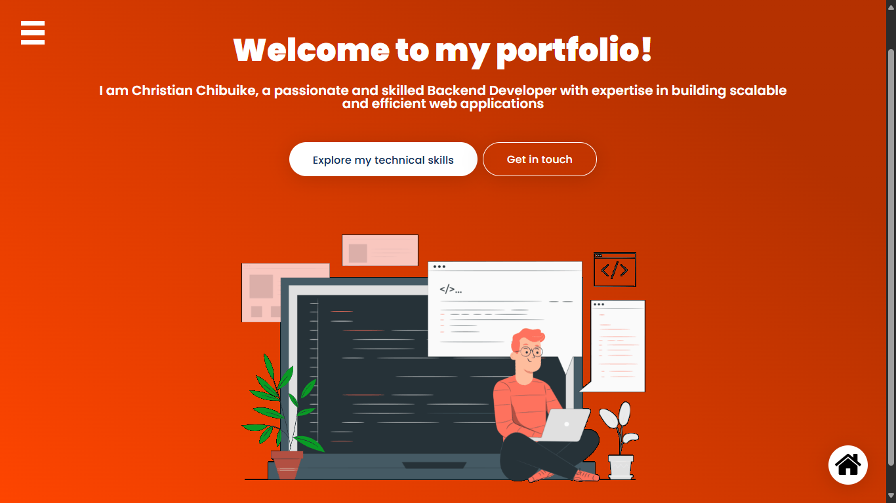
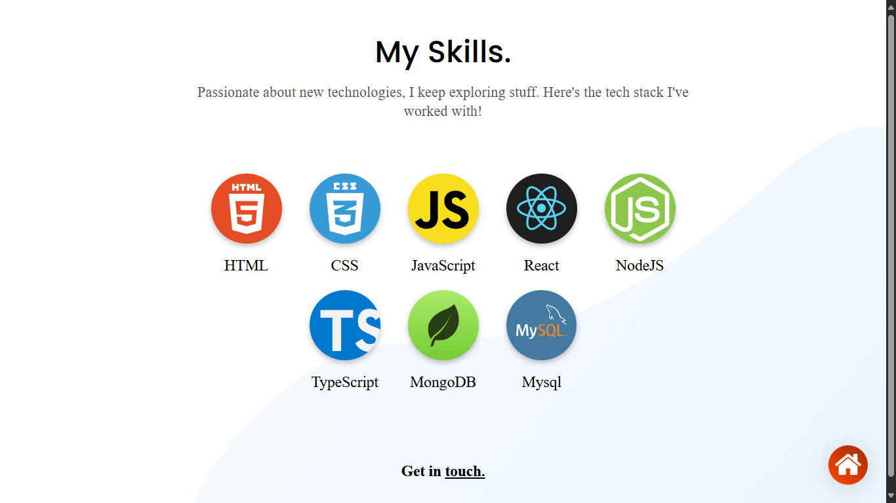

# C3Techie.github.io

A personal portfolio website built with **React.js**, showcasing my **projects**, **skills**, and **professional journey**.  
Fully responsive and optimized for all devices.

---

## 🚀 Tech Stack

- **Frontend:** React.js, HTML5, CSS3
- **Tools & Libraries:**
  - React Hooks (useState, useEffect)
  - Flexbox for layout
  - Responsive Web Design (Mobile-first)
  - Lazy Loading for better performance

---

## 📸 Screenshots

|               Home Page               |              Skills Section               |
| :-----------------------------------: | :---------------------------------------: |
|  |  |

---

## 🛠️ Installation & Setup

Follow these steps to run the project locally:

1. **Clone the repository**

   ```bash
   git clone https://github.com/[your-github-username]/C3Techie.github.io.git
   ```

2. **Navigate to the project directory**

   ```bash
   cd C3Techie.github.io
   ```

3. **Install dependencies**

   ```bash
   npm install
   ```

4. **Run the development server**

   ```bash
   npm start
   ```

5. **View in browser**  
   Open [http://localhost:3000](http://localhost:3000)

---

## 🌐 Live Demo

🔗 [View Portfolio Website](https://your-github-username.github.io/C3Techie.github.io)

_(Replace `your-github-username` with your actual GitHub username after deploying.)_

---

## 📁 Project Structure

```
C3Techie.github.io/
├── public/
│   ├── favicon.ico
│   ├── home.png
│   ├── index.html
│   ├── skills.png
│   └── logo192.png
│   └── other public files...
├── src/
│   ├── assets/
│   │   ├── skills_vector.png
│   │   └── skillsData.js
│   │   ├── css.png
│   │   └── projectData.js
│   │   ├── react.png
│   │   └── others...........
│   ├── components/
│   │   ├── App/
│   │   ├── About/
│   │   ├── Contact/
│   │   └── Home/
│   │   ├── Header/
│   │   ├── Footer/
│   │   ├── Skills/
│   │   └── others/...........
│   └── index.js
├── package.json
├── README.md
└── .gitignore
```

---

## 🎯 Features

- ✅ Minimal, clean UI
- ✅ Skills section generated dynamically
- ✅ Mobile Responsive
- ✅ Flexbox-based layouts
- ✅ Lazy loaded images for faster performance
- ✅ Organized, scalable folder structure

---

## 🧩 Future Improvements

- Add dark mode toggle
- Add animated transitions between sections
- Integrate a working contact form
- Showcase certificates and testimonials

---

## 🙌 Acknowledgements

- [React.js Documentation](https://reactjs.org/docs/getting-started.html)
- [Freepik](https://www.freepik.com/) for vector illustrations
- Inspiration from modern portfolio designs

---

## 📬 Contact

Feel free to reach out!

- 📧 Email: christianchibuike14@gmail.com
- 🔗 [LinkedIn](https://www.instagram.com/c3techie/)
- 🐙 [GitHub](https://github.com/C3Techie)

---

# 🚀 Thank you for visiting!

---
